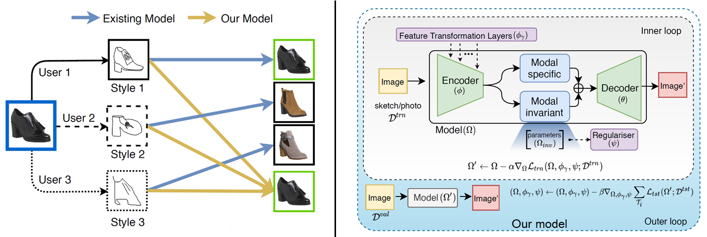
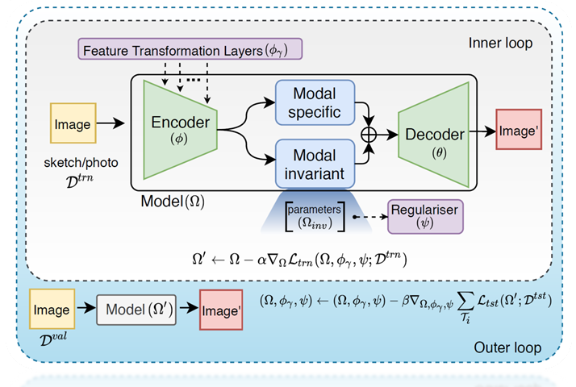
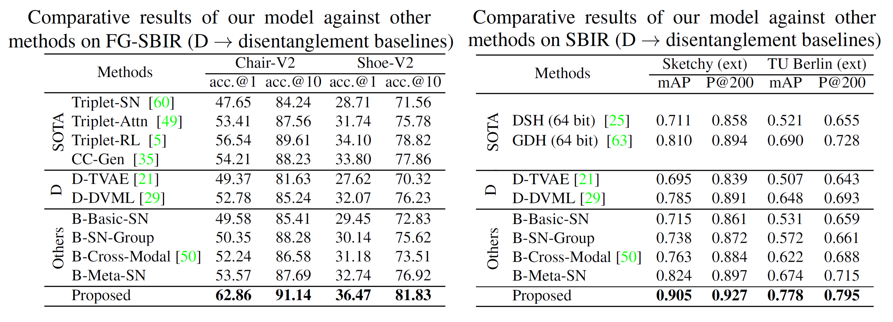
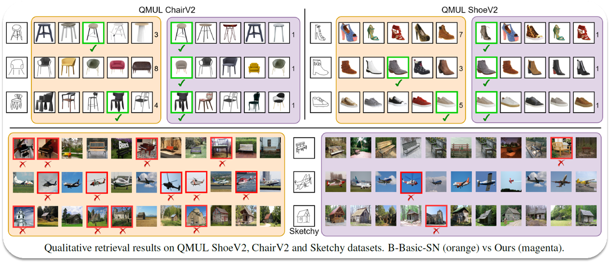
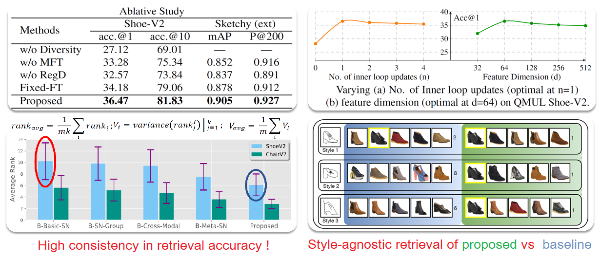

# [StyleMeUp: Towards Style-Agnostic Sketch-Based Image Retrieval](https://aneeshan95.github.io/StyleMeUp/)
#### [Paper](https://arxiv.org/pdf/2103.15706.pdf) accepted in CVPR 2021. 

# Abstract
Sketch-based image retrieval (SBIR) is a cross-modal matching problem which is typically solved by learning a joint embedding space where the semantic content shared between photo and sketch modalities are preserved. However, a fundamental challenge in SBIR has been largely ignored so far, that is, sketches are drawn by humans and considerable style variations exist amongst different users. An effective SBIR model needs to explicitly account for this style diversity, crucially, to generalise to unseen user styles. To this end, a novel style-agnostic SBIR model is proposed. Different from existing models, a cross-modal variational autoencoder (VAE) is employed to explicitly disentangle
each sketch into a semantic content part shared with the corresponding photo, and a style part unique to the sketcher. Importantly, to make our model dynamically adaptable to any unseen user styles, we propose to metatrain our cross-modal VAE by adding two style-adaptive components: a set of feature transformation layers to its encoder and a regulariser to the disentangled semantic content latent code. With this meta-learning framework, our model can not only disentangle the cross-modal shared semantic content for SBIR, but can adapt the disentanglement to any unseen user style as well, making the SBIR model truly style-agnostic. Extensive experiments show that our style-agnostic model yields state-of-the-art performance for both category-level and instance-level SBIR.

# Illustration


Owing to subjective interpretation, different users sketch the same object instance (a shoe here) very differently. Without considering this style diversity, an existing SBIR model yields completely different results for different sketches. With our styleagnostic model, the same intended object is retrieved.
 
# Framework


Our core model is a VAE framework that disentangles the modal variant and invariant semantics in a sketch in a crossmodal translation setting. While a regulariser network regularises parameters of the invariant component (inv), feature transformation (FT) layers aid in style-agnostic encoding following a metalearning paradigm.

## Implementation
* We used QMUL-ChairV2 and QMUL-ShoeV2 datasets (Available [here](http://sketchx.eecs.qmul.ac.uk/downloads/)) for Fine-Grained SBIR, and TUBerlin (ext) and Sketchy(ext) for categorical SBIR.
Please read the [paper](https://arxiv.org/pdf/2103.15706.pdf) for details.

# Results




#Ablative Studies


# Citation
If you find this article useful in your research, please consider citing:

```
@inproceedings{stylemeup,
author = {Aneeshan Sain and Ayan Kumar Bhunia and Yongxin Yang and Tao Xiang and Yi-Zhe Song},
title = {StyleMeUp: Towards Style-Agnostic Sketch-Based Image Retrieval},
booktitle = {CVPR},
year = {2021}
}
```
